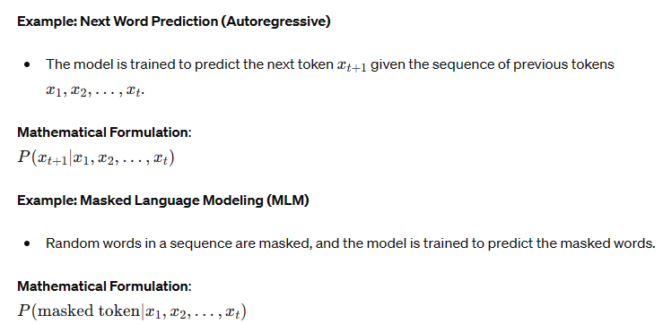
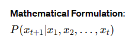
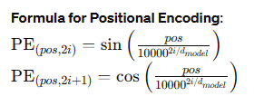
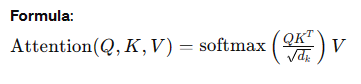
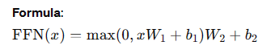

https://www.linkedin.com/pulse/discover-how-chatgpt-istrained-pradeep-menon/


## **How are LLMs trained and how do they generate text. Explain the underlying architecture and the process in a detailed manner.**

### How LLMs Are Trained and Generate Text

Large Language Models (LLMs) are trained through a process that involves large-scale data pre-processing, extensive training on vast datasets, and fine-tuning for specific tasks. The underlying architecture, usually based on the Transformer model, enables these models to generate coherent and contextually relevant text. Let's delve into the detailed process of how LLMs are trained and how they generate text.

### Training Process of LLMs

#### 1. Data Collection and Pre-Processing

- **Data Collection**: LLMs are trained on diverse and extensive corpora, which may include books, articles, websites, and other text sources.
- **Pre-Processing**: The text data is cleaned and tokenized. Tokenization involves breaking down the text into manageable units like words, subwords, or characters.

#### 2. Pre-Training

**Objective**: To learn general language representations from large-scale text data.

- **Self-Supervised Learning**: LLMs are often trained using self-supervised learning objectives, where the model learns to predict parts of the input data from other parts.
- **Common Pre-Training Tasks**:
  - **Next Word Prediction (Autoregressive)**: Models like GPT predict the next word in a sequence.
  - **Masked Language Modeling (MLM)**: Models like BERT predict masked words in a sequence.





#### 3. Fine-Tuning

**Objective**: To adapt the pre-trained model for specific tasks.

- **Supervised Learning**: The model is fine-tuned on a labeled dataset specific to a particular task, such as sentiment analysis, named entity recognition, or text classification.
- **Task-Specific Training**: The model's parameters are adjusted to optimize performance on the target task.

### Generating Text with LLMs

Once trained, LLMs can generate text by leveraging their learned language representations. Here’s a step-by-step explanation of how text generation works:

#### 1. Text Encoding

- **Input Tokenization**: The input text is tokenized into tokens.
- **Positional Encoding**: Since Transformers do not inherently understand the order of tokens, positional encodings are added to provide information about the position of each token.

#### 2. Text Generation Process

**Autoregressive Text Generation (e.g., GPT models)**:
- The model generates text one token at a time, using the previously generated tokens as context.

**Steps**:
1. **Start Token**: Begin with a start token or a prompt.
2. **Generate Next Token**: Use the model to predict the next token based on the current sequence of tokens.
3. **Append Token**: Append the predicted token to the sequence.
4. **Repeat**: Repeat the process to generate the next token until a stopping condition is met (e.g., end of sequence token, max length).

**Example**:
Given the prompt "The quick brown fox", the model generates:
1. "The quick brown fox"
2. "The quick brown fox jumps"
3. "The quick brown fox jumps over"
4. "The quick brown fox jumps over the lazy"
5. "The quick brown fox jumps over the lazy dog."



### Underlying Architecture: Transformer

The Transformer architecture, introduced by Vaswani et al., is the backbone of most LLMs. Here’s a detailed breakdown of its components:

#### 1. Embedding Layer

- Converts input tokens into dense vector representations.

#### 2. Positional Encoding

- Adds positional information to the token embeddings.

**Formula for Positional Encoding**:



#### 3. Multi-Head Self-Attention

- **Self-Attention Mechanism**: Computes attention scores to determine the importance of each token in relation to others.




- **Multi-Head Attention**: Uses multiple attention heads to capture different aspects of the relationships between tokens.

#### 4. Feed-Forward Neural Network

- Applies two linear transformations with a ReLU activation in between.




#### 5. Layer Normalization and Residual Connections

- **Layer Normalization**: Normalizes the input to each sub-layer to stabilize training.
- **Residual Connections**: Adds the input of the sub-layer to its output to help with gradient flow and model depth.

### Diagram of Transformer Architecture

```plaintext
[Input Tokens] --> [Embedding + Positional Encoding] --> [Multi-Head Self-Attention] --> [Feed-Forward Network] --> [Output Tokens]
```

### Example LLMs and Their Architectures

#### GPT-3 (Generative Pre-trained Transformer 3)

| **Feature**       | **Details**                       |
|-------------------|-----------------------------------|
| **Developer**     | OpenAI                            |
| **Architecture**  | Decoder-only Transformer          |
| **Parameters**    | 175 billion                       |
| **Pre-Training**  | Autoregressive (next word prediction) |
| **Applications**  | Text generation, Q&A, code completion |

#### BERT (Bidirectional Encoder Representations from Transformers)

| **Feature**       | **Details**                       |
|-------------------|-----------------------------------|
| **Developer**     | Google AI                         |
| **Architecture**  | Encoder-only Transformer          |
| **Parameters**    | 110 million (BERT-base)           |
| **Pre-Training**  | Masked language modeling          |
| **Applications**  | Text classification, NER, Q&A     |

### Comparison of Popular LLMs

| **Model** | **Developer** | **Architecture**         | **Parameters** | **Pre-Training Tasks**                       | **Key Applications**                             |
|-----------|----------------|-------------------------|----------------|---------------------------------------------|-------------------------------------------------|
| GPT-3     | OpenAI         | Decoder-only Transformer| 175 billion    | Next word prediction (autoregressive)       | Text generation, coding, Q&A                    |
| BERT      | Google AI      | Encoder-only Transformer| 110 million    | Masked language modeling, next sentence prediction | Text classification, NER, Q&A                   |
| T5        | Google Research| Encoder-decoder Transformer| 11 billion | Text-to-text conversion                     | Translation, summarization, Q&A                 |
| RoBERTa   | Facebook AI    | Encoder-only Transformer| 355 million    | Masked language modeling                    | Text classification, NER, Q&A                   |

### Further Reading and URLs

1. **GPT-3**: [OpenAI GPT-3](https://openai.com/research/gpt-3)
2. **BERT**: [Google AI Blog on BERT](https://ai.googleblog.com/2018/11/open-sourcing-bert-state-of-art-pre.html)
3. **T5**: [Exploring the Limits of Transfer Learning with a Unified Text-to-Text Transformer](https://arxiv.org/abs/1910.10683)
4. **RoBERTa**: [RoBERTa: A Robustly Optimized BERT Pretraining Approach](https://arxiv.org/abs/1907.11692)
5. **The Illustrated Transformer**: [jalammar.github.io](http://jalammar.github.io/illustrated-transformer/)

By understanding the training and text generation processes, along with the architecture of LLMs, we can appreciate their capabilities and the reasons behind their widespread adoption in various NLP tasks.