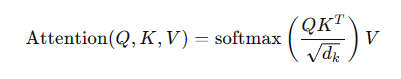

## **What are LLMs in Generative AI? Give examples of the most popular LLMs and underlying architecture.**

Large Language Models (LLMs) are a class of artificial intelligence models that are designed to understand, generate, and manipulate natural language text at a very high level of proficiency. These models are typically based on deep learning architectures, particularly the Transformer architecture, and are pre-trained on vast amounts of textual data to capture a wide range of language patterns and knowledge.

### What Are LLMs?

LLMs are designed to process and generate human-like text by leveraging extensive pre-training on diverse and massive datasets. They use sophisticated neural network architectures, such as Transformers, to model the statistical properties of language and to perform tasks such as text generation, translation, summarization, question answering, and more. The "large" in LLMs refers to the enormous number of parameters they contain, which enables them to learn and represent complex language patterns.

### Key Characteristics of LLMs

1. **Scale**: LLMs have billions or even trillions of parameters, allowing them to capture nuanced language patterns.
2. **Pre-training and Fine-tuning**: They undergo a two-stage training process—pre-training on large, general corpora and fine-tuning on specific tasks.
3. **Generalization**: LLMs can generalize across a wide range of language tasks due to their extensive pre-training.
4. **Transfer Learning**: Knowledge gained during pre-training can be transferred to specific tasks with limited labeled data through fine-tuning.

### Popular Examples of LLMs

#### 1. GPT-3 (Generative Pre-trained Transformer 3)

- **Developer**: OpenAI
- **Architecture**: Decoder-only Transformer
- **Parameters**: 175 billion
- **Key Features**:
  - Autoregressive language model.
  - Excels at text generation, completion, and various NLP tasks.
- **Applications**: Content creation, coding assistance (GitHub Copilot), chatbots (ChatGPT), etc.

| **Feature**       | **Details**                       |
|-------------------|-----------------------------------|
| **Model**         | GPT-3                             |
| **Parameters**    | 175 billion                       |
| **Architecture**  | Decoder-only Transformer          |
| **Use-Cases**     | Text generation, coding, Q&A      |

#### 2. BERT (Bidirectional Encoder Representations from Transformers)

- **Developer**: Google AI
- **Architecture**: Encoder-only Transformer
- **Parameters**: 110 million (BERT-base)
- **Key Features**:
  - Bidirectional context understanding.
  - Pre-trained on masked language modeling and next sentence prediction.
- **Applications**: Text classification, sentiment analysis, named entity recognition (NER), question answering.

| **Feature**       | **Details**                               |
|-------------------|-------------------------------------------|
| **Model**         | BERT (Base)                               |
| **Parameters**    | 110 million                               |
| **Architecture**  | Encoder-only Transformer                  |
| **Use-Cases**     | Text classification, NER, Q&A             |

#### 3. T5 (Text-To-Text Transfer Transformer)

- **Developer**: Google Research
- **Architecture**: Encoder-decoder Transformer
- **Parameters**: 11 billion (T5-11B)
- **Key Features**:
  - Treats every NLP task as a text-to-text problem.
  - Flexible and versatile across various tasks.
- **Applications**: Translation, summarization, text generation, question answering.

| **Feature**       | **Details**                            |
|-------------------|----------------------------------------|
| **Model**         | T5 (11B)                               |
| **Parameters**    | 11 billion                             |
| **Architecture**  | Encoder-decoder Transformer            |
| **Use-Cases**     | Translation, summarization, Q&A        |

#### 4. RoBERTa (A Robustly Optimized BERT Pretraining Approach)

- **Developer**: Facebook AI
- **Architecture**: Encoder-only Transformer
- **Parameters**: 355 million (RoBERTa-large)
- **Key Features**:
  - Improved version of BERT with more training data and longer training times.
  - Enhanced performance on various NLP benchmarks.
- **Applications**: Text classification, sentiment analysis, NER, question answering.

| **Feature**       | **Details**                             |
|-------------------|-----------------------------------------|
| **Model**         | RoBERTa (Large)                         |
| **Parameters**    | 355 million                             |
| **Architecture**  | Encoder-only Transformer                |
| **Use-Cases**     | Text classification, NER, Q&A           |

### Underlying Architecture: The Transformer

The Transformer architecture, introduced by Vaswani et al. in "Attention is All You Need" (2017), is the backbone of most LLMs. Here’s a detailed breakdown of its components:

#### 1. Self-Attention Mechanism

- **Function**: Allows the model to weigh the importance of different words in a sequence relative to each other.
- **Calculation**: Uses queries, keys, and values to compute attention scores.




#### 2. Multi-Head Attention

- **Function**: Extends the self-attention mechanism by using multiple attention heads to capture different aspects of the data.
- **Process**: Each head performs self-attention independently, and the results are concatenated and linearly transformed.

#### 3. Positional Encoding

- **Purpose**: Adds information about the position of words in the sequence since Transformers do not inherently understand order.
- **Method**: Sine and cosine functions of different frequencies.

#### 4. Feed-Forward Neural Network

- **Structure**: Two linear transformations with a ReLU activation in between.
- **Purpose**: Adds non-linearity and depth to the model.

#### 5. Layer Normalization and Residual Connections

- **Layer Normalization**: Stabilizes training by normalizing inputs.
- **Residual Connections**: Helps in gradient flow and allows deeper networks.

### Diagram of Transformer Architecture

```plaintext
[Input Sequence] --> [Embedding Layer + Positional Encoding] --> [Multi-Head Self-Attention] --> [Feed-Forward Neural Network] --> [Output Sequence]
```

### Comparison of Popular LLMs

| **Model** | **Developer** | **Architecture**         | **Parameters** | **Pre-training Tasks**                       | **Key Applications**                             |
|-----------|----------------|-------------------------|----------------|---------------------------------------------|-------------------------------------------------|
| GPT-3     | OpenAI         | Decoder-only Transformer| 175 billion    | Next word prediction (autoregressive)       | Text generation, coding, Q&A                    |
| BERT      | Google AI      | Encoder-only Transformer| 110 million    | Masked language modeling, next sentence prediction | Text classification, NER, Q&A                   |
| T5        | Google Research| Encoder-decoder Transformer| 11 billion | Text-to-text conversion                     | Translation, summarization, Q&A                 |
| RoBERTa   | Facebook AI    | Encoder-only Transformer| 355 million    | Masked language modeling                    | Text classification, NER, Q&A                   |

### Further Reading and URLs

1. **GPT-3**: [OpenAI GPT-3](https://openai.com/research/gpt-3)
2. **BERT**: [Google AI Blog on BERT](https://ai.googleblog.com/2018/11/open-sourcing-bert-state-of-art-pre.html)
3. **T5**: [Exploring the Limits of Transfer Learning with a Unified Text-to-Text Transformer](https://arxiv.org/abs/1910.10683)
4. **RoBERTa**: [RoBERTa: A Robustly Optimized BERT Pretraining Approach](https://arxiv.org/abs/1907.11692)
5. **The Illustrated Transformer**: [jalammar.github.io](http://jalammar.github.io/illustrated-transformer/)

In summary, LLMs represent a significant advancement in AI, offering powerful capabilities for understanding and generating human language. Their underlying Transformer architecture, combined with large-scale pre-training, enables them to excel in a variety of NLP tasks, making them invaluable tools in AI applications today.